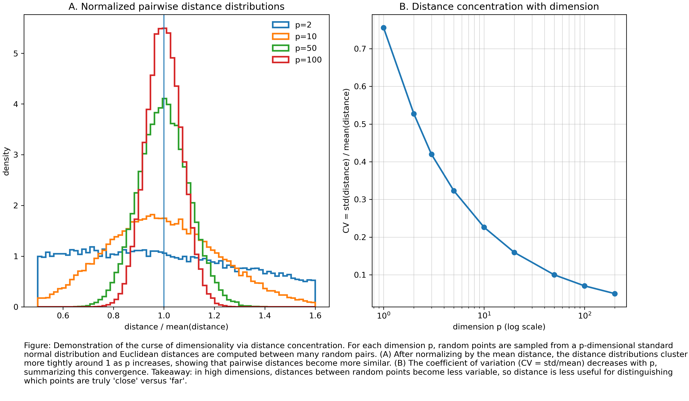

# Curse of Dimensionality — Figure and Summary

## What we did

- We simulated random points in different numbers of dimensions (for example, 2, 10, 50, 100).
- For each dimension, we measured distances between many random pairs of points.
- To compare dimensions fairly, we divided each distance by the mean distance for that dimension (so the plots are on the same scale).
- We made two panels:
  - (A) Histograms of the normalized distances for a few dimensions.
  - (B) A small plot showing how the coefficient of variation (CV = std/mean) changes with dimension.

## Main takeaway

As the number of dimensions increases, pairwise distances become more similar (the histograms get narrower and the CV decreases), so Euclidean distance becomes less useful for distinguishing points in high dimensions.

## Files

- Notebook: data/assignments/CurseofDimensionality/CoD_Orrand/CoD_Orrand.ipynb
- Figure: data/assignments/CurseofDimensionality/CoD_Orrand/figures/curse_of_dimensionality.png

## Notes

- The notebook uses a fixed random seed so the result is repeatable.
- If the figure is missing, run the final figure cell in the notebook to generate `curse_of_dimensionality.png` in the `figures` folder.
