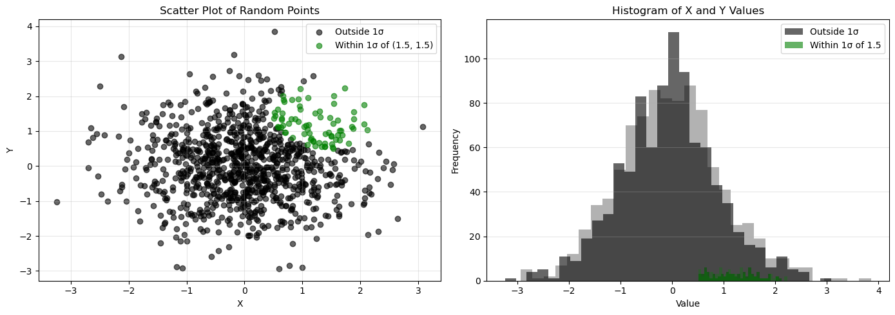

# Curse of Dimensionality Assignment 
## Dahlia Gietka
### Recreating figure 1 from Altman and Krzyzwinski, with randomly generated points.
 
### In two dimensions (scatter plot), 7.40% of points fall within one standard deviation of (1.5, 1.5). In one dimension (histogram), 31.20% of points fall within one standard deviation of 1.5. This highlights the data sparsity that can be a result of too many dimensions, which then makes it much harder to collect data that are representative of the population. 