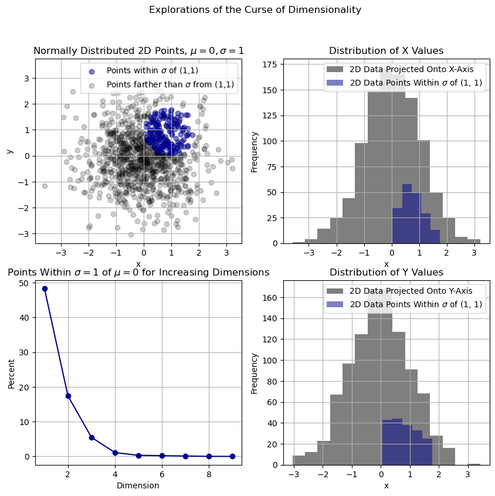

### Curse of Dimensionality Reading Assignment
#### Laura Thomas

*Figure 1: Plots demonstrating the curse of dimensionality. The top left plot shows a 2D Gaussian normal distribution of points with mean 0 and standard deviation 1, with points within one standard deviation of (1,1) highlighted in blue. The top right and bottom right plots show histograms of the frequency of points within one standard deviation of (1,1) for the 2D distribution compared with 1D projections of the data onto the X- and Y-axes, respectively. These histograms show that a greater share of 1D points lie within one standard deviation of 1 than the share of 2D points within one standard deviation of (1,1). The bottom left plot shows that the percent of points within one standard deviation of the mean (0) decreases as the dimensionality of the data increases. All of these plots show that sparsity and distances between points increase with dimension, one of the curses of dimensionality.*