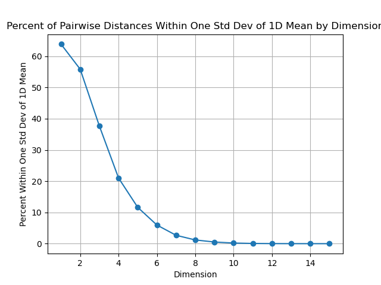

# The Curse of Dimensionality
## By: Michael Hemmett

**Figure 1:** By increasing the dimensionality of a dataset, the fraction of data points with a random pairwise distance within one standard deviation of the mean falls off exponentially. This represents the "curse of dimensionality," or the principle that increasing complexity makes it more challenging to identify meaningful relationships in the data.