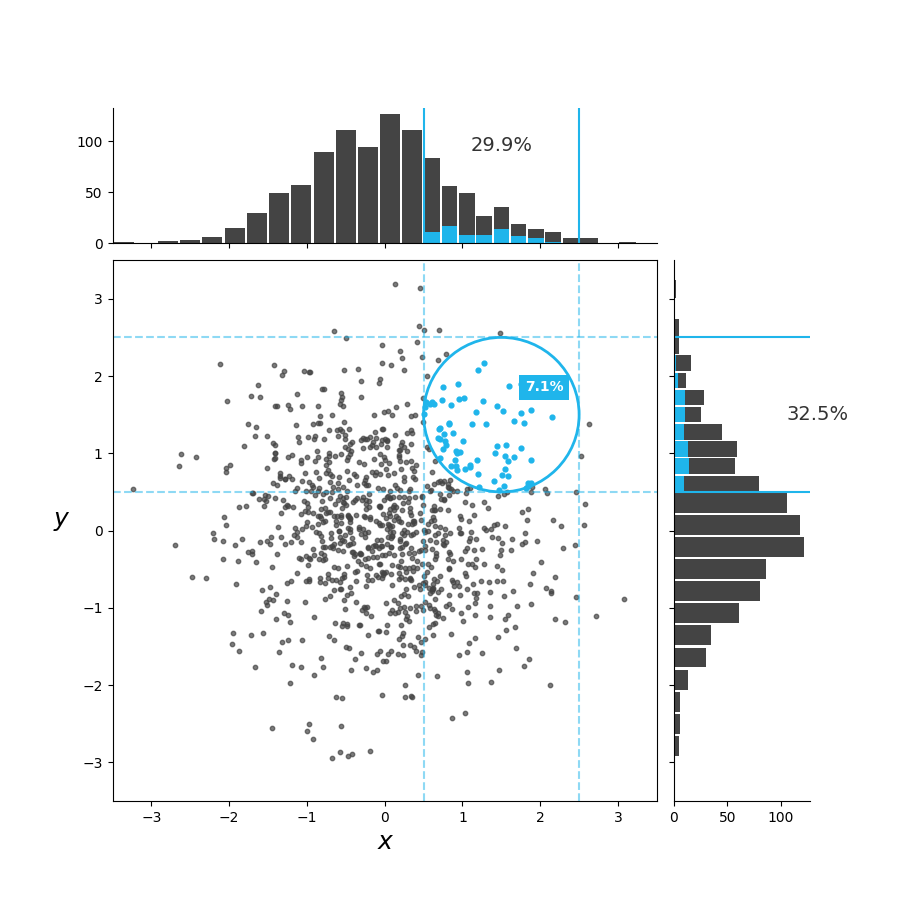

# The Curse of Dimensionality
## David Lovett
### How extra dimensions affect clustering in normally distributed random samples.
<figure>
    
    <figcaption>Fig. 1: A normally distributed random sample of 1000 x,y pairs displayed on a scatterplot that highlights those points which fall between +1 and -1 of (1.5,1.5). Above and beside the scatterplot is are histograms of the X and Y axes respectively and their clustering around (1.5) where the percent value describes how many of the normally distributed random datapoints fall into the +1 or -1 bucket space in just that one dimention. The blue highlights represent the x,y pairs and how they overlap in the one dimensional space. The clustering around 1.5,1.5 in two dimensional space captures about 7% of the points. In 1d space the same distance cutoff captures about 30% of the points, 4 to 5 times more points in the same bucket.</figcaption>
</figure>