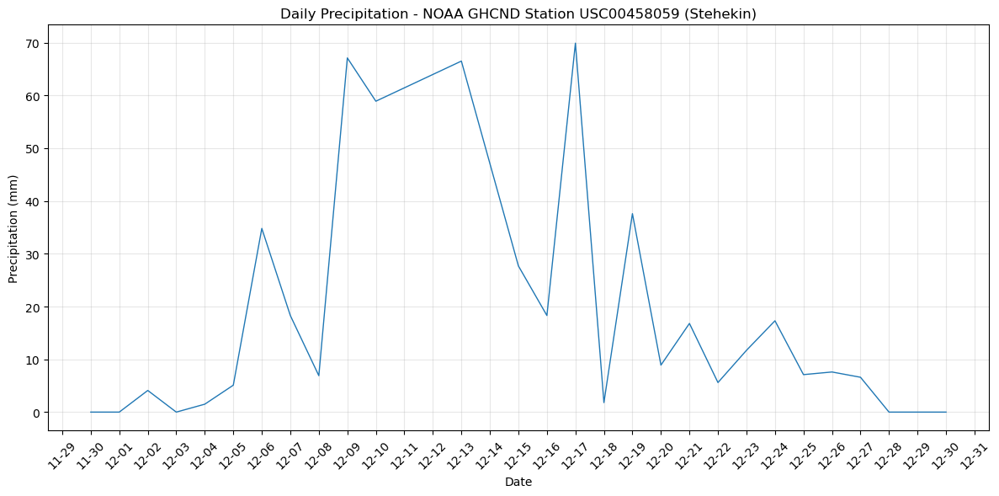
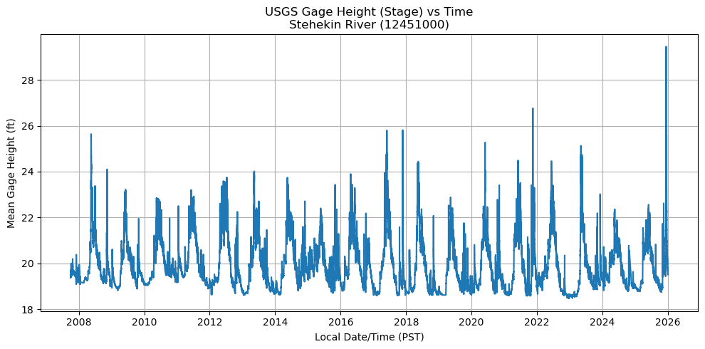
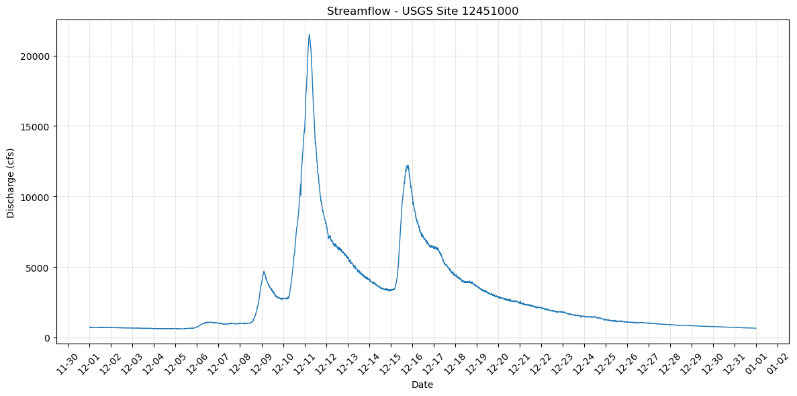

# Climatic Context for the December 2025 Stehekin Debris Flow Event

## Overview
In December 2025, heavy rainfall on recently burned terrain triggered debris flows in the North 
Cascades near Stehekin, Washington. This notebook provides climatic and hydrologic context for the 
event using publicly available precipitation and streamflow data from NOAA and USGS APIs.

The goal of this analysis is to assess whether December 2025 experienced unusually high precipitation 
and river discharge, which may have contributed to slope failure and debris-flow initiation.

---

## Data Sources

- **NOAA Climate Data Online (GHCND: USC00458059)**  
  Daily precipitation data (mm) from the Stehekin 4 NW station covering December 1–31, 2025.  
  Data accessed programmatically using the NOAA CDO API (API token required).

- **USGS Stream Gauge (Site 12451000)**  
  River discharge (cfs) and gage height (ft) data from the Stehekin River at Stehekin, WA for December 
1–31, 2025.  
  Data accessed programmatically using the USGS Water Services API (no authentication required).

---

## Results and Interpretation

Daily precipitation data show multiple storm events throughout December 2025, with rainfall 
intensifying during early and mid-December. The most significant storm occurred on **December 17**, 
recording the highest daily precipitation total (~70 mm). This event followed several consecutive days 
of rainfall, indicating antecedent soil saturation.

  
**Figure 1:** Daily precipitation at NOAA GHCND station USC00458059 (Stehekin) during December 2025.

USGS stream gauge data from the Stehekin River show a strong hydrologic response to these storm 
events. River stage and discharge increased rapidly during mid-December, with peak discharge exceeding 
**20,000 cfs**, consistent with runoff-driven destabilization.

  
**Figure 2:** USGS gage height (stage) for the Stehekin River during December 2025.

  
**Figure 3:** USGS streamflow for the Stehekin River showing discharge response to December 2025 storm 
events.

The combination of intense rainfall, sustained antecedent precipitation, and rapid river rise suggests 
conditions favorable for debris-flow initiation. Recent burn scars in the watershed likely amplified 
runoff and reduced slope stability, increasing debris-flow risk.

---

## Reproducibility

All precipitation and streamflow data were accessed programmatically using public APIs (NOAA CDO and 
USGS Water Services) and processed using Python. The full workflow is documented in the accompanying 
Jupyter notebook.

Relevant API endpoints:
- NOAA CDO: <https://www.ncei.noaa.gov/cdo-web/api/v2/data>  
- USGS NWIS: <https://waterservices.usgs.gov/nwis/iv/>

---

## AI Usage Statement

ChatGPT and Claude AI were used to assist with troubleshooting API access, working with USGS `.rdb` 
file formats, debugging Python code for data ingestion, and resolving plotting issues. AI tools were 
also used to help identify data structures and interpret column formats. All analysis, interpretation, 
and final figures were produced by the team.

